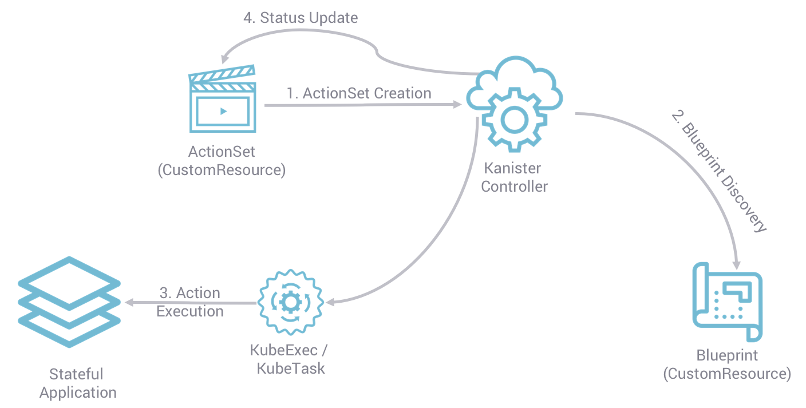

# Development Guide

This document provides instructions on how to build and run Kanister locally.

## Architecture

Kanister is a data management framework written in Go. It allows users to
express data protection workflows using blueprints and actionsets. These
resources are defined as Kubernetes
[Custom Resource Definitions](https://docs.kanister.io/architecture.html#custom-resources)
, following the operator pattern.

[](https://docs.kanister.io/architecture.html)

## Repository Layout

* `build` - A collection of shell scripts used by the Makefile targets to build,
test and package Kanister
* `cmd` - Go `main` packages containing the source of the `controller`,
`kanctl` and `kando` executables
* `docker` - A collection of Dockerfiles for build and demos
* `docs` - Source of the documentation at docs.kanister.io
* `examples` - A collection of example blueprints to show how Kanister works
with different data services
* `graphic` - Image files used in documentation
* `helm` - Helm chart for the Kanister operator
* `pkg` - Go library packages used by Kanister

## Development

The [Makefile](Makefile) provides a set of targets to help simplify the build
tasks. To ensure cross-platform consistency, many of these targets use Docker
to spawn build containers based on the `ghcr.io/kanisterio/build` public image.

For `make test` to succeed, a valid `kubeconfig` file must be found at
`$HOME/.kube/config`. See the Docker command that runs `make test` [here](https://github.com/kanisterio/kanister/blob/fa04d77eb6f5c92521d1413ddded385168f39f42/Makefile#L219).

Use the `check` target to ensure your development environment has the necessary
development tools:

```sh
make check
```

The following targets can be used to lint, test and build the Kanister
controller:
```sh
make golint

make test

make build-controller
```

To build kanister tools (kanctl and kando), use the following conmmand:
```sh
make build GOBORING=true BIN=<kanctl|kando> ARCH=<arm64|amd64>
```

This will build a selected binary `BIN` for a selected architecture `ARCH`.


To build the controller OCI image:
```sh
make release-controller \
  IMAGE=<your_registry>/<your_controller_image> \
  VERSION=<your_image_tag>
```

Update the `IMAGE` variable to reference the image registry you'd like to push
your image to. You must have write permissions on the registry. If `IMAGE` is
not specified, the Makefile will use the default of `kanisterio/controller`.

The `VERSION` variable is useful for versioning your image with a custom tag.
If `VERSION` is not specified, the Makefile will auto-generate one for your
image.

For example, the following command will build and push your image to the
registry at `ghcr.io/myregistry/kanister`, with the tag `20221003`:
```sh
make release-controller \
  IMAGE=ghcr.io/myregistry/kanister \
  VERSION=20221003
```

You can test your Kanister controller locally by using Helm to deploy the local
Helm chart:
```sh
helm install kanister ./helm/kanister-operator \
  --create-namespace \
  --namespace kanister \
  --set image.repository=<your_registry>/<your_controller_image> \
  --set image.tag=<your_image_tag>
```

Subsequent changes to your Kanister controller can be applied using the `helm
upgrade` command:

```sh
helm upgrade kanister ./helm/kanister-operator \
  --namespace kanister \
  --set image.repository=<your_registry>/<your_controller_image> \
  --set image.tag=<your_new_image_tag>
```

### Non-Docker Setup

Most of the Makefile targets can work in a non-Docker development setup, by
setting the `DOCKER_BUILD` variable to `false`.

## Testing

Kanister is using `check` library to extend go testing capabilities: https://github.com/kastenhq/check
It's recommended to write new tests using this library for consistency.

`make test` runs all tests in the repository.
It's possible to run a specific test with `TEST_FILTER` environment variable:

```
make tests TEST_FILTER=OutputTestSuite
```

This variable will be passed to `-check.f` flag and supports regex filters.

To run tests for specific package you can run `go test` in that package directory.
It's recommended to do that in build image shell, you can run it with `make shell`.

The `check` library handles arguments differently from standard `go test`
- to run specific test, you can use `-check.f <test regex>` to filter test (or suite) names
- to increase verbosity, you can use `-check.v` or `-check.vv`
- to controll how many suites from the package run in parallel, you can use `-check.suitep <number>`

See https://github.com/kastenhq/check and https://github.com/kastenhq/check/blob/v1/run.go#L30 for more information


## Integration Tests

Integration tests verify that different components of Kanister work together as
expected. They are located in the `pkg/testing` directory.

### Prerequisites

Before running integration tests, ensure the following:

* **MinIO:** Make sure MinIO is installed and running. Use the following 
  command to install it:
   ```bash
   make install-minio
   ```

### Running Tests

To execute the integration tests, use the following Makefile target:

```bash
make integration-test [app-type]
```

Replace `[app-type]` with one of the following options:

* **`all`:** Runs all integration tests.
* **`short`:** Runs a quick subset of tests for common applications
  (PostgreSQL, MySQL, MongoDB, MSSQL).
* **`openshift ocp_version=<ocp_version>`:** Runs tests specifically for a 
  certain OpenShift version. Replace `<ocp_version>` with the version you 
  want to test (e.g., `openshift ocp_version=4.13`). Currently supported 
  versions are 3.11, 4.4, 4.5, 4.10, 4.11, 4.12, and 4.13.

### Test Selection

You can also control which integration tests are run by setting the 
`TEST_APPS` environment variable.

### Examples

**Running all integration tests:**

```bash
make integration-test all
```

**Running the short suite of tests:**

```bash
make integration-test short  # Or simply 'make integration-test'
```

**Running tests for OpenShift 4.13:**

```bash
make integration-test openshift ocp_version=4.13
```

## Documentation

The source of the documentation is found in the `docs` folder. They are written
in the [reStructuredText](https://docutils.sourceforge.io/rst.html) format.

To rebuild the documentation:

```sh
make docs
```

The `docs` target uses the `ghcr.io/kanisterio/docker-sphinx` public image to
generate the HTML documents and store them in your local `/docs/_build/html`
folder.

## New Documentation

We have started experimenting, and will soon fully transition, to using
 [VitePress](https://vitepress.dev/) to generate Kanister documentation.
This requires the documentation files to be written in 
[Markdown](https://www.markdownguide.org/), along with some 
[extensions](https://vitepress.dev/guide/markdown).

This new documentation system offers a live-dev server that will dynamically
render Markdown documentation files as you are making changes to them on your
local machine/branch.
To start this development server, place yourself in the `docs_new` folder, then
run the following commands:

```sh
pnpm install
pnpm run docs:dev
```

To render/build the docs locally (it will generate static assets, like HTML
pages, Javascript/CSS files, etc.), use this command:
```sh
pnpm run docs:build
```

To start a local webserver that you can use to preview the documentation that
has been rendered by the command above, use this command:
```sh
pnpm run docs:preview
```

## New Blueprints

If you have new blueprints that you think will benefit the community, feel free
to add them to the `examples` folder via pull requests. Use the existing folder
layout as a guide. Be sure to include a comprehensive README.md to demonstrate
end-to-end usage.

## New Kanister Functions

Kanister can be extended with custom Kanister Functions. All the functions are
written in Go. They are located in the `pkg/function` folder.

Take a look at this [PR](https://github.com/kanisterio/kanister/pull/1282) to
see how to write a new Kanister Function.

Don't forget to update the documentation at `docs/functions.rst` with
configuration information and examples to show off your new function.

## Build Kanister image

The Kanister build image [workflow](.github/workflows/kanister-image-build.yaml)
is used to build and push a new Kanister build image (`ghcr.io/kanisterio/build`).
It is an on-demand workflow and needs to be run manually. This workflow expects
`image tag` value as an input.

The author updating the build image tag must raise a separate PR to update this
value for it to be used in the build process. It should be set it [here](https://github.com/kanisterio/kanister/blob/master/Makefile#L61).

## Build MongoDB Atlas tools image

The MongoDB Atlas image [workflow](.github/workflows/atlas-image-build.yaml)
is used to build and push a new Atlas tools image (`ghcr.io/kanisterio/mongodb-atlas`).
It is an on-demand workflow and needs to be run manually when there are changes
in [Atlas dockerfile](docker/mongodb-atlas/Dockerfile). This workflow expects
`image tag` value as an input.
