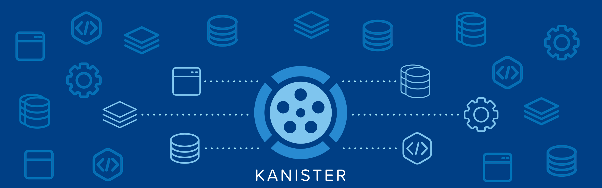

# Kanister

Kanister is a data protection workflow management tool. It provides a set of
cohesive APIs for defining and curating data operations by abstracting away
tedious details around executing data operations on Kubernetes. It's extensible
and easy to install, operate and scale.

## Highlights

✅ _Kubernetes centric_ - Kanister's APIs are implemented as [Custom Resource
Definitions](https://kubernetes.io/docs/tasks/extend-kubernetes/custom-resources/custom-resource-definitions/)
that conforms to Kubernetes' declarative management, security and distribution
models.

✅ _Storage agnostic_ - Kanister allows you to efficiently and securely transfer
backup data between your services and the object storage service of your choice.
Use Kanister to backup, restore, and copy your data using your storage's APIs,
and Kanister won't get in the way.

✅ _Asynchronous or synchronous task execution_ - Kanister can schedule your data
operation to run asynchronously in dedicated job pods, or synchronously via
Kubernetes apimachinery `ExecStream` framework.

✅ _Re-usable workflow artifacts_ -  A Kanister blueprint can be re-used across
multiple workflows to protect different environment deployments.

✅ _Extensible, atomic data operation functions_ - Kanister provides a collection
of easy-to-use
[data operation functions](https://docs.kanister.io/functions.html) that you can
add to your blueprint to express detailed backup and restore operation steps,
including pre-backup scaling down of replicas, working with all mounted volumes
in a pod etc.

✅ _Secured via RBAC_ - Prevent unauthorized access to your workflows via Kubernetes
[role-based access control](https://kubernetes.io/docs/reference/access-authn-authz/rbac/)
model.

✅ _Observability_ - Kanister exposes logs, events and metrics to popular
observability tools like Prometheus, Grafana and Loki to provide you with
operational insights into your data protection workflows.

## Quickstart

Follow the instructions in
[the installation documentation](https://docs.kanister.io/install.html), to
install Kanister on your Kubernetes cluster.

Walk through the [tutorial](https://docs.kanister.io/tutorial.html) to define,
curate and run your first data protection workflow using Kanister blueprints,
actionsets and profiles.

The [`examples`](./examples) directory contains many sample blueprints that you
can use to define data operations for:

- [AWS RDS](./examples/aws-rds)
- [Cassandra](./examples/cassandra)
- [Couchbase](./examples/couchbase)
- [Elasticsearch](./examples/elasticsearch)
- [etcd](./examples/etcd/etcd-in-cluster)
- [FoundationDB](./examples/foundationdb)
- [K8ssandra](./examples/k8ssandra)
- [MongoDB](./examples/mongodb)
- [MongoDB on OpenShift using DeploymentConfig](./examples/mongodb-deploymentconfig)
- [MySQL](./examples/mysql)
- [MySQL on OpenShift using DeploymentConfig](./examples/mysql-deploymentconfig)
- [PostgreSQL](./examples/postgresql)
- [PostgreSQL on OpenShift using DeploymentConfig](./examples/postgresql-deploymentconfig)
- [Redis](./examples/redis)

The Kanister architecture is documented
[here](https://docs.kanister.io/architecture.html).

## Getting Help

If you have any questions or run into issues, feel free to reach out to us on
[Slack](https://kanisterio.slack.com).

GitHub issues or pull requests that have been inactive for more than 60 days
will be labeled as stale. If they remained inactive for another 30 days, they
will be automatically closed. To be exempted from the issue lifecycle, discuss
with a maintainer the reasons behind the exemption, and add the `frozen` label
to the issue or pull request.

If you discovered any security issues, refer to our [`SECURITY.md`](SECURITY.md)
documentation for our security policy, including steps on how to report
vulnerabilities.

## Community

The Kanister community meetings happen once every two weeks on Thursday, 16:00
UTC, where we discuss ongoing interesting features, issues, and pull requests.
Come join us! Everyone is welcome! 🙌 (Zoom link is pinned on Slack)

If you are currently using Kanister, we would love to hear about it! Feel free
to add your organization to the [`ADOPTERS.md`](ADOPTERS.md) by submitting a
pull request.

## Code of Conduct

Kanister is for everyone. We ask that our users and contributors take a few
minutes to review our [Code of Conduct](CODE_OF_CONDUCT.md).

## Resources

- [CNCF - Enhancing data protection workflows with Kanister and Argo workflows](https://youtu.be/nqfP1e9jeU4)
- [CNCF - Kanister: Application-Level Data Protection on Kubernetes](https://youtu.be/GSgFwAHLziA)
- [CNCF - Integrating Backup Into Your GitOps CI/CD Pipeline](https://www.youtube.com/watch?v=2zik5jDjVvM)
- [DoK - Kanister & Kopia: An Open-Source Data Protection Match Made in Heaven](https://www.youtube.com/watch?v=hN8sn3A_oEs)
- [DoK - Kanister: Application-Level Data Operations on Kubernetes](https://www.youtube.com/watch?v=ooJFt0bid1I&t=791s)
- [Kanister Overview 2021 ](https://www.youtube.com/watch?v=wFD42Zpbfts&t=1s)
- [SIG Apps Demo](https://youtu.be/uzIp-CjsX1c?t=82)
- [Percona Live 2018](https://www.youtube.com/watch?v=dS0kv0k8D_E)

## License

Apache License 2.0, see [LICENSE](https://github.com/kanisterio/kanister/blob/master/LICENSE).
