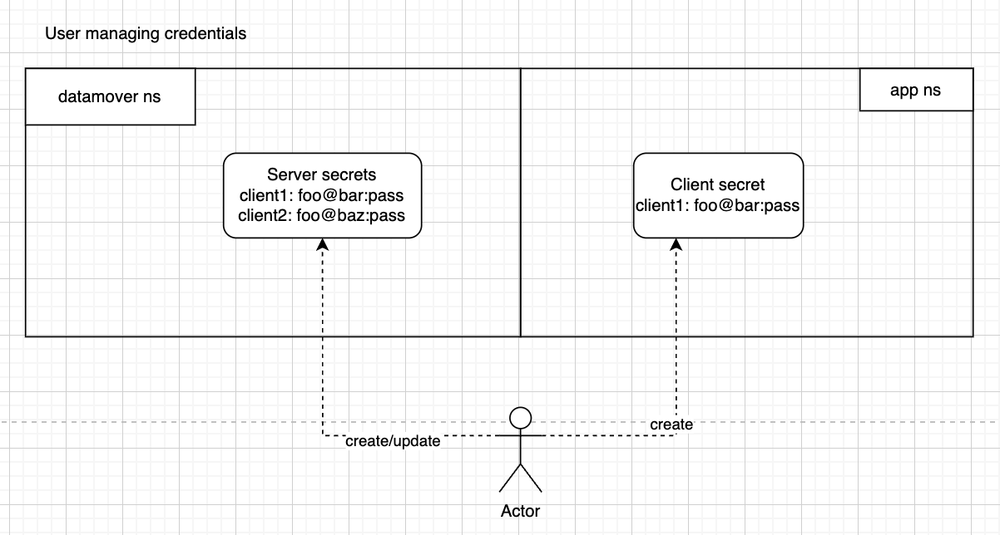

# Datamover abstraction for Kanister

## NOTE: this is a proncipal design proposal. Some details, names and APIs might change in the future.

**TODO: update this document to reflect actual design when it's done.**

## Background

Kanister currently uses a range of different tools such as stow, restic and kopia to export backup data to the backup storage.

These different tools are used in different parts of the kanister to export different types of backups.

For example stow is used to save database dumps in `kando`, restic is used to export volume contents in `BackupData` function and
kopia is used in parallel functionset to restic in functions like `BackupDataUsingKopiaServer`.

All these tools serve similar functions and can be (and were historically) deprecated and replaced with each other over time.

Unfortunately they are also used from the codebase and integrated and intertwined in the existing code, making it harder to just swap them.

Adding parallel code paths also leads to explosion of API space (such as introducing `...UsingKopiaServer` functions).

If we had a clearer abstractions and separation between generic kanister functions and datamover-specific code, it would make it easier
to deprecate or switch datamovers or implement new ones compatible with kanister.

## Datamover function and scope

Datamover is a functionality used or implemented by kanister to upload backups to the remote storage.

Kanister executes datamover functions as phases in actionsets.

Currently kanister builds the `kando` tool with built-in datamover tools and uses it from `kanister-tools` image.

### Types of data sent by datamover

- Files from filesystem.

This approach can be used both for uploading specific files, and also to export entire volume contents to external storage.
Example: creating CSI snapshot, mounting it as a PVC, exporting contents via datamover.

- Output of DB dump commands

This approach currently uses stream input (unix pipe) for `kando` command and uploads the stream as a single "file" to external storage.

**NOTE:** Technically in UNIX terms, the second approach can be thought of as uploading a file, but using a file descriptor instead of physical storage to read the file.

### Additional setup for datamover

Some datamover implementations (e.g. kopia) require addititional setup for the storage.

Storage configured to accept backups is often called a **reposiroty**.

Repository setup would set up reposotory structure, access keys and even a proxy server to manage access sessions.

These additional steps need to run before the main backup operation.

Sometimes it needs to be done outside of a single backup operation, for example when there are multiple backups using the same repository, also if repository already exists.

Repository also provides context for backup artifacts (e.g. backupID)

#### Examples of repository setup

Both restic and kopia require repository setup commands to be run before repository can be used (https://restic.readthedocs.io/en/stable/030_preparing_a_new_repo.html, https://kopia.io/docs/repositories/)

Kopia can be used with a proxy server, which needs to be started before backup (https://github.com/kanisterio/kanister/blob/master/design/kanister-kopia-integration.md)

## Goals of the new design

### Goals

- Make it easy to implement new datamovers or replace datamovers without reworking a lot of the code
	- Ideally new datamover implementations can be added without any changes to the existing kanister code
- Support kopia datamover implementation
- Support existing backup modes and clear up APIs for them

### Nice-to-haves (secondary goals)

- Remove datamover-specific integrations from kanister codebase
- Remove usage of Exec from execution of setup and backup operations

### Non-goals

- Backwards compatibility between different datamover repos (e.g. migrating data between repos)
- Using multiple datamovers with the same repository (like they do in [Velero datamover design](https://github.com/vmware-tanzu/velero/blob/main/design/Implemented/unified-repo-and-kopia-integration/unified-repo-and-kopia-integration.md) )
- Support for Restic datamover **restic datamover is up to deprecation if favour of kopia**

## Proposed design and abstractions

### Main objectives of the design

- Define datamover-agnostic backup/restore API which can be used by actionsets in kanister
- Define the datamover-agnostic orchestration API to set up datamover components (to prepare repositories and sessions)
- Define requirements to the implementation to integrate with the APIs provided
- Provide vocabulary and map separation of concerns between components to guide future changes


### Data flow and access

Datamover data flow process can be described as following:

- **Data source** is the data we want to backup e.g. Volumes, DB dumps, snapshots, files etc.

- **Data storage** is the place we want to store our backups e.g. S3, GCP cloud storage etc.

- **Datamover repository session** (or **datamover server**) has access to the data storage
	This component needs to be set up before backup function is called.
	It can be a part of the backup action, or be set up in advance.

- **Datamover client** function has access to the data source
  This function is triggered as a kanister function, e.g. CopyVolumeData

- Datamover client function has access to repository session and sends data to the storage via the repository session


#### Example: kopia datamover using kopia server

Kopia datamover approach is described in more details in https://github.com/kanisterio/kanister/blob/master/design/kanister-kopia-integration.md

Here is how it maps into the data flow:


#### Example: colocating datamover server and session in the same namespace

We can run datamover client in the same namespace as the repository session,
then separation only reflects abstraction between source and destination and not access control.

For example kanister Profile is a repository access session, but it is accessible to kanister backup functions and
those functions have direct access to the repository.


Another example is if we copy the data source (e.g. via CSI snapshot) into a datamover namespace and run the client
in the same namespace as the server, which can be useful to share credentials between client and server.


#### Data flow components separation

Designing separate client and session components lets us control access to the storage repository (either via configuration or proxy server).
It lets us run client component in the namespace and with access to the data source (which is usually in the application namespace).
It provides an abstraction between backup and restore functions and the actual data destination.

*The main benefit for data flow separation is abstraction of data source and data destination*


### Datamover implementation abstraction

Different tools (e.g. kopia, restic) can act as a datamover layer in the data flow. In order for them to be interchangeable, we need
to separate generic and specific components of **datamover client** and **datamover server**.

Specific datamover us called an **implementation**, components specific to a datamover are called **implementation specific**
Components of the design which are same for all datamovers are called **generic**


The abstraction layers separation can be describe as following:

- The API layer has the most *generic* concepts:
	- Set up **repository session** for some **data storage**
	- Perform filesystem backup for some **data source**
	- Perform filesystem restore for some **data source**

- The parameters layer is a set of parameters passed to the API which configures:
  - Which datamover *implementation* is used in the operation
  - *Implementation specific* configuration
  - Runtime configuration for workloads to run the datamover

**NOTE** runtime configuration is *generic* (same across implementations), but values in there would depend on the implementation requirements.

- The workloads layer is a code and workload resources (in k8s) which will be created as a result of an API call
  - Workloads are usually represented as Pods and services in K8s and facilitated by Kanister functions
  - Workloads are *generic* and do not depend on the implementation
  - Workloads are configured by runtime configuration
  - Workloads are passing datamover parameters to implementation running in the workload

- Implementation layer is implementation specific code running in the workloads
	- Implementation is configured with parameters

### Mapping K8s components in datamover abstraction

- API layer is repesented by:
	- Kanister functions e.g. `CopyVolumeData`
	- Special purpose CRDs e.g. `DatamoverServer` (name is not final) or `Profile`

These functions and CRDs provide fields for *implementation specific* configurations as well
as some fields for *generic* configurations.

Example of generic fields:
- `podOptions` to control runtime configuration of a pod
- `volume` to pick a PVC to back up in `CopyVolumeData`

Example of specific fields:
- `image` to pick the datamover implementation
- `envs` to pass environment configurations to the implementation
- `clientSecret` to pass credentials to the client to access the session

**NOTE** while *implementation specific* fields contain specific data, the field names and formats are same for all datamovers.

**API layer is defined in kanister functions code, which MUST NOT contain any *implementation specific* components.**

- Parameters layer is represented by:
	- Values of the fields in the kanister functions and CRDs

**Parameters layer CAN BE defined in kanister Blueprints or as a parameter to ActionSets**

- Workload layer is represented by:
	- Repository session (server) pod and service running repository session setup
	- Pods running backup for kanister functions
	- Potentially exec commands to running sidecar containers executed by kanister functions

Since workload layer is run by kanister functions code (or controllers), it is *generic* and workloads it runs
do not depend on the implementation.
We define a set of rules and signals that workloads should handle to make it so.

Workloads pass parameters to implementation using volume mounts, files and container arguments

- Implementation layer is represented by:
	- Code running in workload containers

Implementation layer is of course *implementation specific* but it communicates with the workload layer using
*generic* rules and files which are same for all implementations.


## Details of implementing abstractions

### Separating generic and specific components

Generic datamvoer components:

- Datamover server (aka repository session) CRD which should run a pod and a service
- Datamover client pod which should connect to datamover server and perform backup operation

**NOTE** *server* and *session* are used interchangeably in this doc until it's refined and we can find a better name

In order to make client work with a server:
- Client credential propagation infra
    Client sessions are secret and require extra session management
- Communication in opaque server information to the client to pass non-secret data from server to client
    E.g. information about ports/protocols/tcp fingerprints

Specific components:

Server implementation:

- Image to run in the server pod container (with certain requirements)
- Configmap to be mounted in server pod (with some implementation specific configs)
- A set of secrets to be mounted in server pod

Client implementation:

- Image to run in the client pod container (with certain requirements)
- Configmap to be mounted in the client pod with implementation specific configs
- A set of secrets to be mounted to the client pod

A new datamover implementation will need to provide images for server/client and
description on how to make the configmap and the secrets.

### Running the datamover

- To run a datamover server, the operator will need to create the server configmap, the secrets and the CR of `datamoverserver` kind.

- To run a datamover client, the operator will need to create the client configmap, the secrets and execute a kanister function which will set up the client.
    **NOTE:** we might implement running a client as a go function if necessary, but it needs to be
    a pod with certain parameters so it should be somewhat easier via kanister.

## Going deeper: component specific design proposal

### Datamover server

Datamover server will run as a pod with service defined by the following CRD:

```
apiVersion: dm.cr.kanister.io/v1alpha1
kind: DatamoverServer
metadata:
  labels:
    app.kubernetes.io/name: example-datamover
  name: example-datamover
spec:
  image: <datamover_server_implementation_image>
  protocols:
    - name: <name-compatible-with-k8s-labels>
      port: <TCP port number>
  config:
    name: <configmap name>
  clientSecretRef:
    secretName: <clients secret name>
  startupProbe: ...
  readinessProbe: ...
  secrets:
    - secretName: ...
    - secretName: ...
status:
  progress: <phase>
  serverInfo:
    data: Zm9vCg==
```

Spec fields:

- `image` - server implementation
- `config` - reference to configmap
    mounted to `/etc/config`
- `clientSecretRef` - reference to a secret containing the list of client credentials
    mounted to `/etc/client_credentials`
    **dynamic** implementation **MUST** monitor this file and update credentials
- `secrets` - a list of implementation specific secrets
    mounted to `/etc/secrets/<secret_name>`
    **dynamic** implementation **MAY** monitor these files
- `startupProbe/readinessProbe/livenessProbe` - lifecycle probes to set in the main container
    **optional** but recommended to communicate readiness to clients

Status fields:
- `progress` - state of the server
    Set to `Ready` once the server is initialized, takes `startupProbe/readinessProbe` into account
- `serverInfo` - information to expose to the clients
    - `serviceName` - name of the k8s service to provide access to the server
    - `data` - Base64 string cintaining implementation specific data
        data is read from `/etc/server/data` file after `readinessProbe` succeeds

### Datamover client


#### Background on state of clients

Currently we have 2 main modes to run datamover clients:

- Filesystem backup/restore: backup/restore all files from a directory
- Stream backup/restore: backup/restore a stream of data piped from a DB dump

Stream backup/restore can be seen as a special case of file backup/restore with named pipes ([example blueprint](https://github.com/kanisterio/kanister/blob/b30dd9f80f88142f760729549f2ae3346ef48290/examples/mysql/blueprint-v2/mysql-blueprint.yaml))

We also currently use two main ways to orchestrate backup operations:

- Creating a pod with attached datasource (PVC or DB dump container)
- Executing commands in kanister-tools container attached to a running pod

Running a datamover client for former is more straight-forward and we will mostly focus on that.
Running datamover in a sidecar container is still doable and will be addressed in the [sidecar container](#sidecar_container) section.

#### Client design proposal

**NOTE** currently only considering clients running as pods and not as sidecar containers

##### Filesystem backups

Datamover client is run as a kanister function with the following arguments:

```
- func: CopyVolumeDataDM ## RestoreVolumeDataDM for restore
  name: cvd
  args:
    namespace: app-namespace
    ## Operation fields
    volume: <pvc name>
    dataPath: <data path prefix>
    tag: <OPTIONAL: backup tag>

    ## Datamover fields
    image: <client implementation image>
    datamoverServer:
      name: <datamover server name>
      namespace: <datamover server namespace>
    clientSecret: <client credentials secret>
    config: <configmap name>
    env: <env variables to configure the datamover>
    secrets:
      - <secret name>

    ## Extra fields
    labels: ...
    annotations: ...
    podOverride: ...
```

This function will run the client pod which should backup data from (or restore to)
the `dataPath` directory of `volume` PVC.


##### Generic (API layer) parameters

These parameters do not depend on specific datamover implementation:

- Function name `CopyVolumeDataDM`
- `namespace`
- `volume`
- `dataPath`
- `tag`

##### Implementation specific (parameter layer) parameters

- `image` - image containing client implementation
- `datamoverServer` - reference to server to connect to (**this field might come from the ActionSet instead**)
- `clientSecret` - secret containing client credential (**WIP: there are better ways to propagate credentials**)
- `env` - environment variables with implementation specific config
- `config` - configmap with implementation specific config
- `secrets` - any extra secrets needed for client to run

##### Database dump backups

In case of database dump stream backups, the client function will look like:

```
- func: DumpDM ## RestoreDumpDM for restore
  name: dump
  args:
    namespace: app-namespace
    ## Operation fields
    dumpFile: <path to file> ## restoreFile for restore
    dumpImage: <database tools image> ## restoreImage for restore
    dumpCommand: <command to dump database into dumpFile> ## restoreCommand for restore

    ## Datamover fields
    image: <client implementation image>
    datamoverServer:
      name: <datamover server name>
      namespace: <datamover server namespace>
    clientSecret: <client credentials secret>
    config: <configmap name>
    secrets:
      - <secret name>

    ## Extra fields
    labels: ...
    annotations: ...
    podOverride: ...
```

Datamover fields will remain the same, but this function will create multi-container pod
where one container will execute `dumpCommand` with `dumpImage` and another will read
the `dumpFile` and send it to the server.

In case of restore the datamover should pipe data to the `restoreFile` and `restoreCommand` should
apply it to the DB.

#### Flow diagram representing a backup using this function


## Implementing datamovers

### Server

Datamover server accepts TCP connections on a port using protocol (e.g. kopia)
and provide an implementation specific API to save data to some storage.

Types of storage, storage credentials and protocols are all implementation specific.

- Server is created as a pod with the server implementation container.
- Server container **MUST** have an entrypoint preparing and executing the server process
- Server **MUST** check the `PROTOCOLS` env variable and verify that it supports the protocols requested
  - If server does not support one of the protocols, it should fail with appropriate message
- Server **SHOULD** read `/etc/config` and `/etc/secrets/<secret_name>` folders to initialize
- Server **SHOULD** monitor (dynamically changing) `/etc/client_credentials` folder and update client access
  - Since it's a secret mount, it will contain multiple records mounted as files in this folder
  - Each client credential is a string in implementation specific format
- Server **MAY** write `/etc/server/data` file to communicate implementation specific data to clients (e.g. TCP fingerprint)
- Server **MAY** support additional commands to be used in `startupProbe/readinessProbe/livenessProbe`
- IF server intends to write `/etc/server/data`, it **MUST** do that before `startupProbe/readinessProbe` succeed
  - Currently datamover controller reads `/etc/server/data` only once, may be subject to change in the future
- Server logs **MUST** be accessible via the pod logs
- If server fails, it **MUST** terminate the container OR be detected by `livenessProbe` to restart the container

Server implementation is distributed as an image and **MUST** document format and requirements
for configmap and secrets supported.

### Client

Datamover client reads data and sends it to datamover server OR requests data from datamover
server and writes it to destination.

- Client is created as a pod with the client implementation container.
- Client container **MUST** have an entrypoint to execute the backup/restore operation
  - Client container **MUST** support arguments specifying the type of the operation:
    - `backup_files` - backup files from directory (e.g. CopyVolumeData)
    - `restore_files` - restore files to directory
    - `backup_stream` - backup stream data from a file
    - `restore_stream` - restore stream data and pipe it into a file
- Client **MUST** check the `PROTOCOLS` env variable and verify that it supports **AT LEAST ONE** protocol
  - If no protocols supported, client must exit with appropriate message
- Client **MUST** use the protocol and port specified in the `PROTOCOLS` env variable to connect to server
- Client **MUST** use `SERVER_URL` env variable to connect to the server
- Client **SHOULD** read `/etc/config` and `/etc/secrets/<secret_name>` folders to initialize
- Client **MAY** read other environment variables to configure
- Client **MUST** read `/etc/client-secret` folder to extract credentials **WIP: subject of change in case we rework credential propagation**
- Client **MAY** use `SERVER_DATA` env variable to get server specific information (may be required to connect)
- Client **MUST** terminate normally upon finishing the operation
- Client **MUST** terminate on error with appropriate message
- Client logs **MUST** be accessible via pod logs

### Client credentials

Client credential secret is a special kind of secret which is not entirely implementation specific.
Server secret containing client credentials MUST be a key-value map, where keys should be client IDs and values should be credentials in implementation specific format.

This allows kanister (*generic* components) to add/remove clients from the servers client list without knowing the format.

Server implementation will have the secret mounted to `/etc/client_credentials` directory as files and **SHOULD** monitor these files and update ACL dynamically.

Clients version of this secret would have a single `client_id: credential` value in the secret and can effectively ignore the `client_id`

#### Client APIs and operation modes

Datamover client implementation can support one or many operation modes such as:
- `backup_files <path> <tag>` - backup files from directory (e.g. CopyVolumeData)
- `restore_files <path> <tag>` - restore files to directory
- `backup_stream <filename>` - backup stream data from a `filename`
- `restore_stream <filename>` - restore stream data and pipe it into a `filename`

These operations are passed to the datamover implementation as container arguments.

**Additional operation modes can be added to this abstraction in the future**

If client does not support provided arguments, it **MUST** exit with an error (terminating the pod)

Additional operation types we may support:

- `command_from_file filename` - run datamover client reading operations from file.
	This mode can be used in long-running sidecar containers to live pods in order to dynamically trigger operations.
	To trigger an operation, an operation args string should be written to the `filename` and datamover should execute it
	as if it was passed in the args to the implementation

- `start_flr_server` - run file level restore server to allow APIs to list and restore specific files
	FLR APIs are still work in progress.


### Defining implementation

Since some parameters are implementation specific, each implementation **MUST** provide a set of required and optional
parameters to configure the datamover.

Example parameters list for kopia datamover could look like this (this is a documentation, not a config):

```
protocols: # Protocols should be used in both client and server
	 - name: kopia-v0-17-0
     port: 51515

client credential format: # Format for client credential string
	user@host:password

Server:
image: kopia-datamover/server:latest # Image to use for server
config: # Information needed in the configmap
	hostname # string - server->repo auth hostname
  username # string - server->repo auth username
  rootPath # string - path in the repo
  cacheDirectory # string, optional -server local cache
  configFilePath # string, optional - server local config
  logDirectory  # string, optional - server local log dir
  contentCacheSizeMb # number, optional
  metadataCacheSizeMb # number, optional
startup probe: # How the startup probe needs to be configured
	wait on /etc/server/data
secrets: # List of secrets and data in them which datamover server will use
	repo-access-secret:
		password # string - password to the repo
	admin-secret:
	  password # string - password for server admin
	  username # string - server admin user name
	storage-secret:
		type # string - type of storage to use for repository (e.g. s3/filesystem, etc)
	  bucket # string - storage config (specific to type)
    prefix # string - storage config (specific to type)
    region # string - storage config (specific to type)
    endpoint # string - storage config (specific to type)
	storage-credentials-secret: # Storage credentials, specific to storage type
		aws_access_key_id
	  aws_secret_access_key
	tls-secret: # kubernetes.io/tls type secret
		tls.crt
		tls.key


Client:
image: kopia-datamover/client:latest # Image to use for client
modes: # Modes supported by this client image
	backup_files
	restore_files
env: # Env variables this client supports
	CONTENT_CACHE_MB
	METADATA_CACHE_MB
	CONFIG_FILE
	...
```


## Work in progress/open questions

### Client credential propagation

Since namespaces in which server and client are runnig will be different, currently
we need to create client credential secrets in both client and server namespaces.



We can also consider an option to use K8s token API to request credentials from server using K8s token instead.
This will avoid additional operation and a need to have permissions in application namespace.


*This is WIP and more design details will follow.*

### Integrating S3 proxy with datamover server

Because of the generic nature of datamover server we might consider making S3 proxy
an protocol implementation within the datamover server.

In that case we would add `s3` to `protocols` field and run a server within datamover
with support for S3 protocol connections.

A single implementation of datamover server can support multiple protocols and we can
colocate S3 server with kopia server for example.


