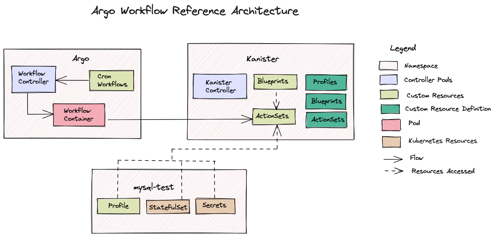
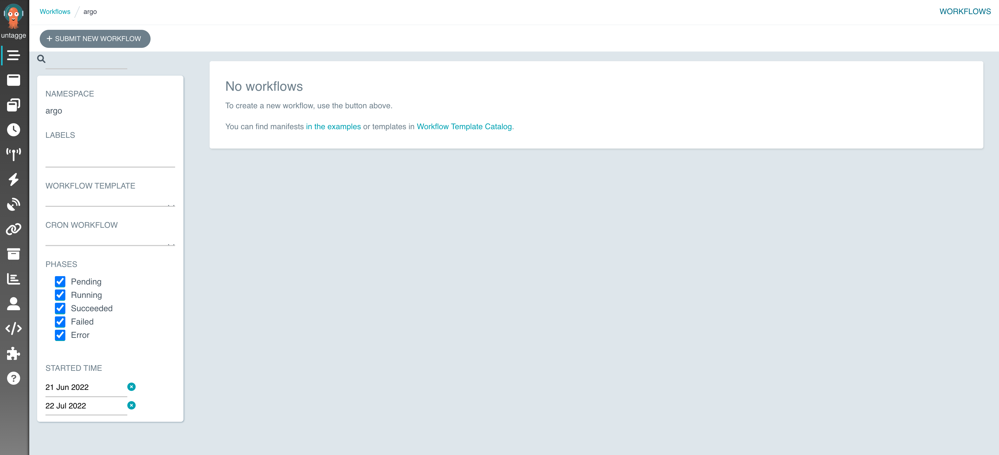
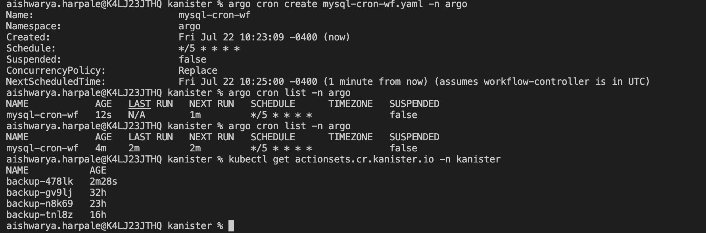
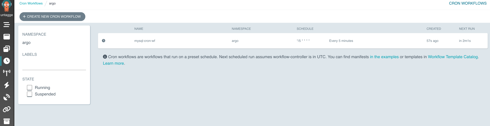
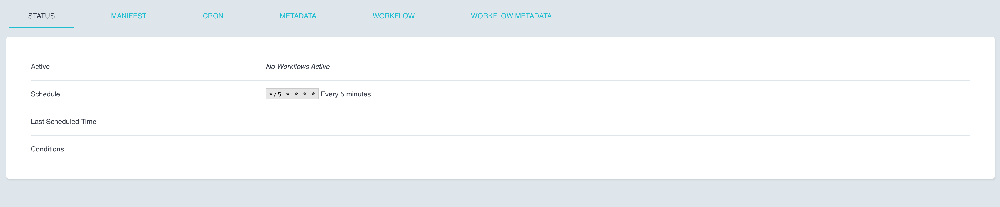

Leveraging ActionSet Creation using Argo Cron Workflows
------------------------------------------------------------

Argo Workflows enable us to schedule operations. In the Kanister project,
Argo Cron Workflows will be used to automate the creation of ActionSets to
backup an application at regular intervals.

To summarize, ActionSets are CRDs that are used to backup or restore an application.
The controller present in the Kanister namespace looks for ActionSets to
execute in the given namespace.

In this tutorial you will schedule the creation of a backup actionset using
Argo Cron Workflows.


Prerequisites
===============
- Kubernetes 1.16+
- Kanister controller version 0.80.0 installed in your cluster, let's assume in
  Namespace kanister
- Kanctl CLI installed (https://docs.kanister.io/tooling.html#install-the-tools)

Architecture
===============



Steps -
===============


Step 1 - Setup Argo
``````````````````````

Download the Argo CLI from their Releases_ page.

Create a separate namespace for the Workflows.

.. code-block:: bash

  kubectl create ns argo

For this tutorial, the minimal manifest file will be used to download
Argo CRDs and setup their resources.
Download the minimal manifest file from their Examples_ page.

On downloading this yaml file, you may configure the managed namespaces
as per your use case.
You may read more about managed namespaces here - ManagedNamespaces_

In this tutorial, the minimal manifest will be used as it is.

.. code-block:: bash

  kubectl apply -f quick-start-minimal.yaml -n argo

Port-forward to view the Argo UI:

.. code-block:: bash

  kubectl -n argo port-forward deployment/argo-server 2746:2746

Open a web browser and navigate to ``localhost:2746``



Step 2 - Setup a sample application to backup.
``````````````````````````````````````````````````

Here, you will reference the MySQL_ example from Kanister.
Install the Chart and setup MySQL in the ``mysql-test`` namespace.
Make sure that the application is integrated with Kanister and the following
steps are completed.

1. A Profile CR is created for the ``mysql-test`` namespace.
2. A MySQL blueprint is created in the ``kanister`` namespace.
3. Check the name of the blueprint, stateful set, profile and
   secrets for you application for the next step.

Step 3 - Creating a Cron Workflow
````````````````````````````````````````````

Now a Cron Workflow will be created that will automate the creation of an actionset
to backup our MySQL application. You will need to modify the names of the blueprint,
stateful set, profile and secrets as per the ones you have created.
Modify the last line of the following yaml file as follows.

.. code-block:: bash

  kanctl create actionset --action backup --namespace kanister --blueprint [YOUR_BLUEPRINT_NAME] --statefulset [YOUR_STATEFULSET] --profile [YOUR_PROFILE_NAME] --secrets [YOUR_SECRETS_NAME]

Then execute -

.. code-block:: bash

  cat<<EOF >> mysql-cron-wf.yaml
  apiVersion: argoproj.io/v1alpha1
  kind: CronWorkflow
  metadata:
    name: mysql-cron-wf
  spec:
    schedule: "*/5 * * * *"
    concurrencyPolicy: "Replace"
    workflowSpec:
      entrypoint: automate-actionset
      templates:
        - name: automate-actionset
          container:
            image: ghcr.io/kanisterio/kanister-tools:v9.99.9-dev
            command:
              - /bin/bash
              - -c
              - |
                microdnf install tar
                curl -LO https://github.com/kanisterio/kanister/releases/download/0.80.0/kanister_0.80.0_linux_amd64.tar.gz
                tar -C /usr/local/bin -xvf kanister_0.80.0_linux_amd64.tar.gz
                kanctl create actionset --action backup --namespace kanister --blueprint mysql-blueprint --statefulset mysql-test/mysql-release --profile mysql-test/s3-profile-gd4kx --secrets mysql=mysql-test/mysql-release
  EOF

Note - Here, the cron-job is scheduled to run every 5 minutes. You may schedule
it to run as per your requirements.

Step 4 - Granting RBAC permissions.
````````````````````````````````````````````

Next, you will grant the Service Account in our ``argo`` namespace to access resources
in the ``kanister`` and ``mysql-test`` namespace. This is required to create CRs based on
the Secrets and StatefulSets that you provided in our previous step.
You may read more about RBAC authorization here - RBAC_.

1. Create a ClusterRole named ``cron-wf-manager`` having the permissions in
   ``cluster-admin``.
2. Grant these permissions to the default ServiceAccount named
   ``default`` in the ``argo`` namespace.
3. This will be done by creating a RoleBinding in the ``kanister``
   and ``mysql-test`` namespaces.

Execute the following -

.. code-block:: bash

  kubectl create rolebinding cron-wf-manager --clusterrole=cluster-admin --serviceaccount=argo:default -n kanister

.. code-block:: bash

  kubectl create rolebinding cron-wf-manager --clusterrole=cluster-admin --serviceaccount=argo:default -n mysql-test

Step 5 - Launching the Cron Workflow
--------------------------------------

Lets launch the workflow in the ``argo`` namespace by running -

.. code-block:: bash

  argo cron create mysql-cron-wf.yaml -n argo

Check if the workflow was created by running -

.. code-block:: bash

  argo cron list -n argo

When the workflow runs, check if the ActionSet was created in the ``kanister`` namespace -

.. code-block:: bash

  kubectl get actionsets.cr.kanister.io -n kanister



Here, the workflow was created and scheduled to run in 1 minute. After it ran
successfully, the `last run` field was updated with the timestamp of the last run.
A backup ActionSet was created. The age of this ActionSet is seen as recently created.

Submit the Cron Workflow by running -

.. code-block:: bash

  argo submit mysql-cron-wf.yaml

You should see the following on the Argo UI -



On clicking on it -



Troubleshooting
===============

If the Cron Workflow does not run, check if the pod to run the workflow was
created in the ``argo`` namespace. Examine the logs of this pod.

.. code-block:: bash

  kubectl logs [NAME_OF_MYSQL_CRON_WORKFLOW_POD] -n argo

If this pod was not created, examine the logs of the Argo Workflow Controller
in the ``argo`` namespace.

.. code-block:: bash

  kubectl logs [NAME_OF_WORKFLOW_CONTROLLER] -n argo

If the logs mention that you have not granted the right permissions to the
ServiceAccounts, circle back to Step 4 and check the names of your ServiceAccounts
and namespaces.

.. code-block:: bash

  kubectl get serviceaccounts -n argo

Cleanup
===============

Delete the cron workflow by running the following. Verify the name of your
workflow before deleting it.

Verify workflow name -

.. code-block:: bash

  argo cron list -n argo

Delete workflow -

.. code-block:: bash

  argo cron delete mysql-cron-wf

Deleting the Argo CRs.

Run -

.. code-block:: bash

  kubectl delete -f quick-start-minimal.yaml

Deleting the Argo namespace -

.. code-block:: bash

  kubectl delete namespace argo


.. _Releases: https://github.com/argoproj/argo-workflows/releases/latest
.. _Examples: https://raw.githubusercontent.com/argoproj/argo-workflows/master/manifests/quick-start-minimal.yaml
.. _ManagedNamespaces: https://argoproj.github.io/argo-workflows/managed-namespace/
.. _MySQL: https://github.com/kanisterio/kanister/tree/master/examples/mysql
.. _RBAC: https://kubernetes.io/docs/reference/access-authn-authz/rbac/

